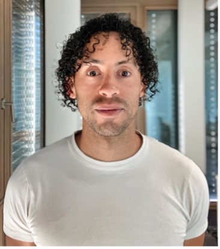

# About me

I completed my PhD entitled “Executive functions, self-paced exercise and cycling performance". My main interest is to understand the cognitive and neural bases of exercise to bridge the gap between sport science, experimental psychology and cognitive neuroscience. During the PhD, I have worked on several articles on this topic. Moreover, I am interested in meta research in interdiscinplinary topics. My main interest is the area mental fatigue and exercise in both direction, i.e., the topic impact of exercise on mental fatigue (delaying the onset) or the impact of performing a mental exertion task on a subsequent physical exercise.

Currently,  I am researcher at the University of Lausanne in Switzerland and the University of Granada in Spain. I am always open to collaborate if we have similar interests and vision of science.

I am a believer of Open Science (e.g., preregistration of studies, open access data), but it is not the only way of doing better. For a full CV, [click here](https://drive.google.com/file/d/1DJUXNLIzsLcR9Pl0d1wBuOcVNei2_YOG/view?usp=sharing)

Research is part of my life, but it is also baking (cheesecakes), running, cycling and filming, and normally the combination of all of them.

---

